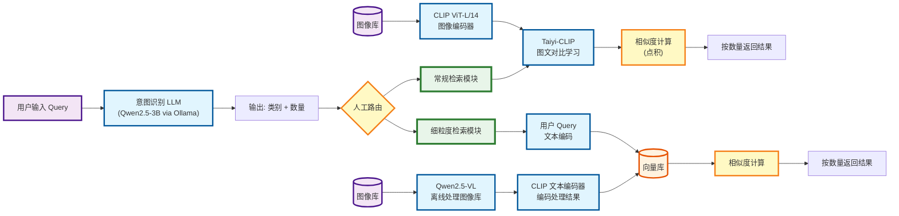

## 多模态检索系统 v0 架构

```mermaid
flowchart LR
    %% 输入 -> 意图识别
    User["用户输入 Query"] --> IntentLLM["意图识别 LLM<br/>(Qwen2.5-3B via Ollama)"]
    IntentLLM --> IntentOut["输出: 类别 + 数量"]

    %% 人工路由分叉
    IntentOut --> Route{"人工路由"}

    %% ===== 常规检索路径 =====
    Route --> Regular["常规检索模块"]
    Regular --> CLIP_Text["Taiyi-CLIP<br/>图文对比学习"]
    ImageDB_R[("图像库")] --> CLIP_Vis["CLIP ViT-L/14<br/>图像编码器"]
    CLIP_Vis --> CLIP_Text
    CLIP_Text --> SimReg["相似度计算<br/>(点积)"]
    SimReg --> ResultReg["按数量返回结果"]

    %% ===== 细粒度检索路径 =====
    Route --> Fine["细粒度检索模块"]

    %% 离线阶段
    ImageDB_F[("图像库")] --> OfflineVL["Qwen2.5-VL<br/>离线处理图像库"]
    OfflineVL --> OfflineText["CLIP 文本编码器<br/>编码处理结果"]
    OfflineText --> VectorDB[("向量库")]

    %% 在线阶段
    Fine --> QueryEnc["用户 Query<br/>文本编码"]
    QueryEnc --> VectorDB
    VectorDB --> SimFine["相似度计算"]
    SimFine --> ResultFine["按数量返回结果"]

    classDef io fill:#f3e5f5,stroke:#4a148c,stroke-width:3px
    classDef model fill:#e1f5fe,stroke:#01579b,stroke-width:3px
    classDef data fill:#fff3e0,stroke:#e65100,stroke-width:3px
    classDef decision fill:#fff9c4,stroke:#f57f17,stroke-width:3px
    classDef stage fill:#e8f5e9,stroke:#2e7d32,stroke-width:4px

    class User,ImageDB_R,ImageDB_F io
    class IntentLLM,CLIP_Text,CLIP_Vis,OfflineVL,OfflineText,QueryEnc model
    class VectorDB data
    class Route,SimReg,SimFine decision
    class Regular,Fine stage
```
