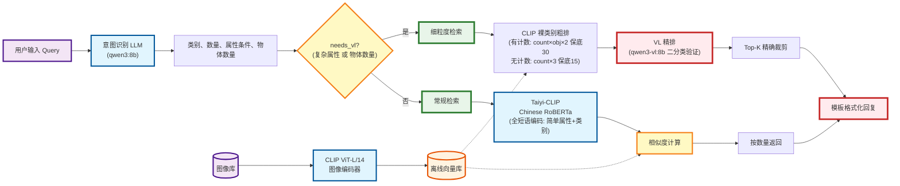

## 多模态检索系统 v1 架构

```mermaid
flowchart LR
    %% 输入 -> LM 提取
    User["用户输入 Query"] --> Qwen-LM["意图识别 LLM<br/>(qwen3:8b)"]
    Qwen-LM --> LM_output["类别、数量、属性条件、物体数量"]
    LM_output --> NeedsVL{"needs_vl?<br/>(复杂属性 或 物体数量)"}

    %% 图像库 -> 离线向量库
    ImageDB[("图像库")] --> CLIP_Vis_Offline["CLIP ViT-L/14<br/>图像编码器"]
    CLIP_Vis_Offline --> VectorDB[("离线向量库")]

    %% VL 精排路径（计数 或 复杂属性）
    NeedsVL -->|是| VLPath["细粒度检索"]
    VLPath --> CLIP_Coarse["CLIP 裸类别粗排<br/>(有计数: count×obj×2 保底30<br/>无计数: count×3 保底15)"]
    VectorDB -.-> CLIP_Coarse
    CLIP_Coarse --> VL_Refine["VL 精排<br/>(qwen3-vl:8b 二分类验证)"]
    VL_Refine --> TopK_VL["Top-K 精确裁剪"]

    %% CLIP-only 路径（简单属性 或 无属性）
    NeedsVL -->|否| CLIPOnly["常规检索"]
    CLIPOnly --> CLIP_Text["Taiyi-CLIP<br/>Chinese RoBERTa<br/>(全短语编码: 简单属性+类别)"]
    CLIP_Text --> SimCalc["相似度计算"]
    VectorDB -.-> SimCalc
    SimCalc --> TopK_Reg["按数量返回"]

    %% 回复格式化
    TopK_VL --> FormatReply["模板格式化回复"]
    TopK_Reg --> FormatReply

    classDef io fill:#f3e5f5,stroke:#4a148c,stroke-width:3px
    classDef model fill:#e1f5fe,stroke:#01579b,stroke-width:3px
    classDef data fill:#fff3e0,stroke:#e65100,stroke-width:3px
    classDef decision fill:#fff9c4,stroke:#f57f17,stroke-width:3px
    classDef stage fill:#e8f5e9,stroke:#2e7d32,stroke-width:4px
    classDef highlight fill:#ffebee,stroke:#c62828,stroke-width:4px

    class User,ImageDB io
    class Qwen-LM,CLIP_Text,CLIP_Vis_Offline model
    class VectorDB data
    class NeedsVL,SimCalc decision
    class VLPath,CLIPOnly stage
    class VL_Refine,FormatReply highlight
```

### 检索方式

统一使用 **TopK** 取相似度最高的前 K 个结果。模糊量词（"很多"、"一些"）默认 K=10，具体数字按用户请求数量返回。
