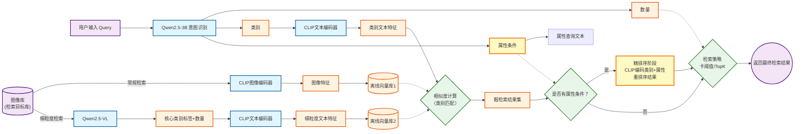

## 多模态检索系统架构（v2 - 支持属性条件两阶段检索）

```mermaid
flowchart LR
    User["用户输入 Query"] --> Qwen3B["Qwen2.5-3B 意图识别"]
    Qwen3B --> Quantity["数量"]
    Qwen3B --> Category["类别"]
    Qwen3B --> Attributes["属性条件"]
    
    Category --> CLIP_Text_Query["CLIP文本编码器"]
    CLIP_Text_Query --> Query_Feat["类别文本特征"]
    Attributes --> Attr_Query["属性查询文本"]
    
    ImageDB[("图像库<br/>(检索目标库)")] -->|常规检索| CLIP_Vis["CLIP图像编码器"]
    CLIP_Vis --> Img_Feat["图像特征"]
    Img_Feat --> VectorDB1[("离线向量库1")]
    
    ImageDB -->|细粒度检索| QwenVL["Qwen2.5-VL"]
    QwenVL --> VL_Tag["核心类别标签+数量"]
    VL_Tag --> CLIP_Text_DB["CLIP文本编码器"]
    CLIP_Text_DB --> VL_Text_Feat["细粒度文本特征"]
    VL_Text_Feat --> VectorDB2[("离线向量库2")]
    
    Query_Feat --> CoarseSim{"相似度计算<br/>（类别匹配）"}
    VectorDB1 -.-> CoarseSim
    VectorDB2 -.-> CoarseSim
    CoarseSim --> CoarseResults["粗检索结果集"]
    
    CoarseResults --> AttrFilter{"是否有属性条件？"}
    Quantity -.-> Strategy
    Attributes -.-> AttrFilter
    
    AttrFilter -->|是| Refine["精排序阶段<br/>CLIP编码类别+属性<br/>重排序结果"]
    AttrFilter -->|否| Strategy{"检索策略<br/>卡阈值/TopK"}
    Refine --> Strategy
    
    Strategy --> Output(("返回最终检索结果"))
    
    classDef io fill:#f3e5f5,stroke:#4a148c,stroke-width:2px
    classDef model fill:#e1f5fe,stroke:#01579b,stroke-width:2px
    classDef data fill:#fff3e0,stroke:#e65100,stroke-width:2px
    classDef calc fill:#e8f5e9,stroke:#2e7d32,stroke-width:2px
    classDef new fill:#fff9c4,stroke:#f57f17,stroke-width:3px
    
    class User,Output,ImageDB io
    class Qwen3B,CLIP_Text_Query,CLIP_Vis,QwenVL,CLIP_Text_DB,Refine model
    class Quantity,Category,Attributes,Method,Query_Feat,Img_Feat,VectorDB1,VectorDB2,VL_Tag,VL_Text_Feat,CoarseResults data
    class CoarseSim,AttrFilter,Strategy calc
    class Attributes,Refine new
```
