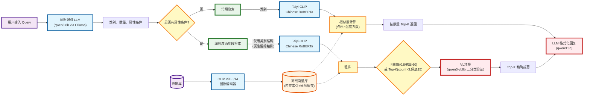

## 多模态检索系统架构

```mermaid
flowchart LR
    %% 输入 -> LM 提取
    User["用户输入 Query"] --> Qwen-LM["意图识别 LLM<br/>(qwen3:8b via Ollama)"]
    Qwen-LM --> LM_output["类别、数量、属性条件"]
    LM_output --> HasAttr{"是否有属性条件?"}

    %% 图像库 -> 离线向量库
    ImageDB[("图像库")] --> CLIP_Vis_Offline["CLIP ViT-L/14<br/>图像编码器"]
    CLIP_Vis_Offline --> VectorDB[("离线向量库<br/>(内存索引+磁盘缓存)")]

    %% 无属性条件路径（常规检索）
    HasAttr -->|否| RegularPath["常规检索"]
    RegularPath -->|类别| CLIP_Text["Taiyi-CLIP<br/>Chinese RoBERTa"]
    CLIP_Text --> SimCalc["相似度计算<br/>(点积×温度系数)"]
    VectorDB -.-> SimCalc
    SimCalc --> TopK1["按数量 Top-K 返回"]

    %% 有属性条件路径（细粒度两阶段检索）
    HasAttr -->|是| CoarseStage["细粒度两阶段检索"]
    CoarseStage -->|"仅用类别编码<br/>(属性留给精排)"| CLIP_Text2["Taiyi-CLIP<br/>Chinese RoBERTa"]
    CLIP_Text2 --> CoarseRank["粗排"]
    VectorDB -.-> CoarseRank
    CoarseRank --> Strategy{"卡阈值(0.8/截断60)<br/>或 Top-K(count×3,保底15)"}
    Strategy --> VL_Refine["VL精排<br/>(qwen3-vl:8b 二分类验证)"]
    VL_Refine --> TopK2["Top-K 精确裁剪"]

    %% 回复格式化
    TopK1 --> FormatReply["LLM 格式化回复<br/>(qwen3:8b)"]
    TopK2 --> FormatReply

    classDef io fill:#f3e5f5,stroke:#4a148c,stroke-width:3px
    classDef model fill:#e1f5fe,stroke:#01579b,stroke-width:3px
    classDef data fill:#fff3e0,stroke:#e65100,stroke-width:3px
    classDef decision fill:#fff9c4,stroke:#f57f17,stroke-width:3px
    classDef stage fill:#e8f5e9,stroke:#2e7d32,stroke-width:4px
    classDef highlight fill:#ffebee,stroke:#c62828,stroke-width:4px

    class User,ImageDB io
    class Qwen-LM,CLIP_Text,CLIP_Text2,CLIP_Vis_Offline,VL_Refine model
    class VectorDB data
    class HasAttr,Strategy,SimCalc,CoarseRank decision
    class RegularPath,CoarseStage stage
    class VL_Refine,FormatReply highlight
```
