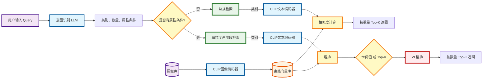

## 多模态检索系统架构

```mermaid
flowchart LR
    %% 输入 -> LM 提取
    User["用户输入 Query"] --> Qwen-LM["意图识别 LLM"]
    Qwen-LM --> LM_output["类别、数量、属性条件"]
    LM_output --> HasAttr{"是否有属性条件?"}

    %% 图像库 -> 离线向量库
    ImageDB[("图像库")] --> CLIP_Vis_Offline["CLIP图像编码器"]
    CLIP_Vis_Offline --> VectorDB[("离线向量库")]

    %% 无属性条件路径（常规检索）
    HasAttr -->|否| RegularPath["常规检索"]
    RegularPath -->|类别| CLIP_Text["CLIP文本编码器"]
    CLIP_Text --> SimCalc["相似度计算"]
    VectorDB --> SimCalc
    SimCalc --> TopK1["按数量 Top-K 返回"]
    
    %% 有属性条件路径（细粒度两阶段检索）
    HasAttr -->|是| CoarseStage["细粒度两阶段检索"]
    CoarseStage -->|类别| CLIP_Text2["CLIP文本编码器"]
    CLIP_Text2 --> CoarseRank["粗排"]
    VectorDB --> CoarseRank
    CoarseRank --> Strategy{"卡阈值 或 Top-K"}
    Strategy --> VL_Refine["VL精排"]
    VL_Refine --> TopK2["按数量 Top-K 返回"]
    
    classDef io fill:#f3e5f5,stroke:#4a148c,stroke-width:3px
    classDef model fill:#e1f5fe,stroke:#01579b,stroke-width:3px
    classDef data fill:#fff3e0,stroke:#e65100,stroke-width:3px
    classDef decision fill:#fff9c4,stroke:#f57f17,stroke-width:3px
    classDef stage fill:#e8f5e9,stroke:#2e7d32,stroke-width:4px
    classDef highlight fill:#ffebee,stroke:#c62828,stroke-width:4px
    
    class User,ImageDB io
    class Qwen-LM,CLIP_Text,CLIP_Text2,CLIP_Vis_Offline,VL_Refine model
    class VectorDB data
    class HasAttr,Strategy,SimCalc,CoarseRank decision
    class RegularPath,CoarseStage,VL_Refine stage
    class VL_Refine highlight
```
